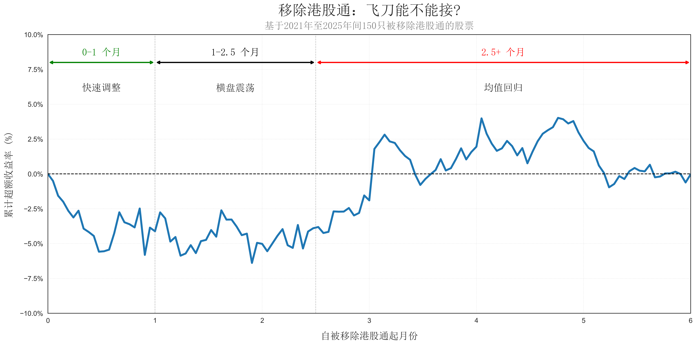

This repository stores the code and data used in creating the blog post "Out of Stock Connect: Fallen Angel or Value Trap?"

In the world of Hong Kong equities, few events are as dreaded as an exclusion from the Stock Connect, the vital link that allows mainland Chinese investors to trade Hong Kong-listed stocks (Southbound) and vice versa (Northbound). The pool of eligible Southbound stocks is primarily reviewed and adjusted twice a year, trailing the semi-annual Hang Seng Index reviews. For a listed company, being removed from this list means losing access to a massive reservoir of Southbound capital. But for a value investor, the question isn't just about the exit—it’s about what happens after the dust settles.

Is an excluded stock a "Value Trap" destined for obscurity, or a "Fallen Angel" primed for a rebound? I conducted an event study tracking the Cumulative Abnormal Return (CAR) of stocks over the six months following their exclusion. 

This study analyzes Stock Connect exclusion events occurring between 2021 and 2025, covering a robust sample of 150 stocks. The data for this analysis was retrieved from official exchange announcements and the Yahoo Finance API. Here is what the data tells us.

Phase 1: The Immediate Shock (0–1 Month)
The data shows a sharp contraction immediately following the exclusion. Within the first 21 trading days, these stocks typically experience a plunge in returns relative to the Hang Seng Index (HSI), bottoming out on average between -5% and -6%.

This isn't necessarily a reflection of the company’s fundamentals; instead, it represents a "liquidity cliff." Institutional funds that benchmark against indices requiring Stock Connect eligibility are forced to divest, while mainland Chinese investors can no longer purchase these shares. This creates a lopsided environment of heavy selling pressure with far fewer buyers willing to "catch the falling knife."

Phase 2: Stabilization & Exhaustion (1–2.5 Months)
Between month one and month 2.5, the "bleeding" typically stops, though a meaningful recovery has yet to begin. During this period, we observe a phase of volatile consolidation, with the CAR bouncing between -3% and -6%.

This stage represents "seller exhaustion." At this point, the majority of investors forced to liquidate have already exited their positions. For patient investors, this phase often presents a golden opportunity, as the stock frequently trades at a significant "exclusion discount"—a price level driven more by structural selling than by any shift in the company's underlying value.

Phase 3: The Rebound (2.5+ Months)
The trend undergoes a notable reversal after the 2.5-month mark. By month three, the CAR often crosses back into positive territory.

This suggests that for many companies, the exclusion is a temporary liquidity shock rather than a permanent loss of value. Once the forced selling ends, "value hunters" step in, recognizing that the stock has been oversold. The market begins to price the company based on its actual earnings and dividends again, rather than its eligibility for a specific trading link.

The Verdict: Fallen Angel or Value Trap?
While every stock is different, the aggregate data leans heavily toward the Fallen Angel hypothesis.

The exclusion creates an artificial price depression driven by structural factors rather than business failure. The "sweet spot" for investors appears to be the 8 to 10-week mark after exclusion—once the initial panic has subsided and the selling pressure has stabilized.
